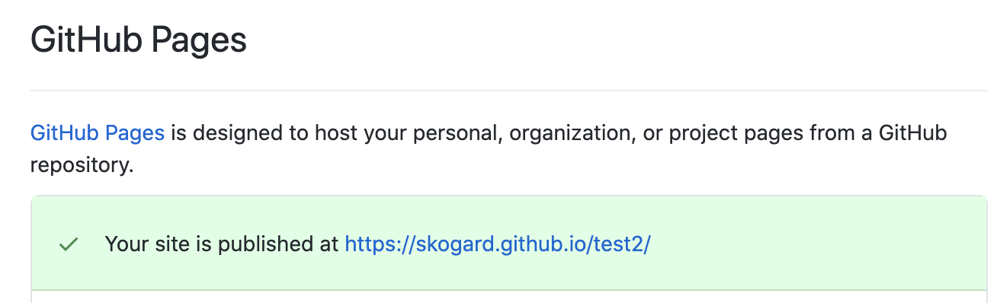
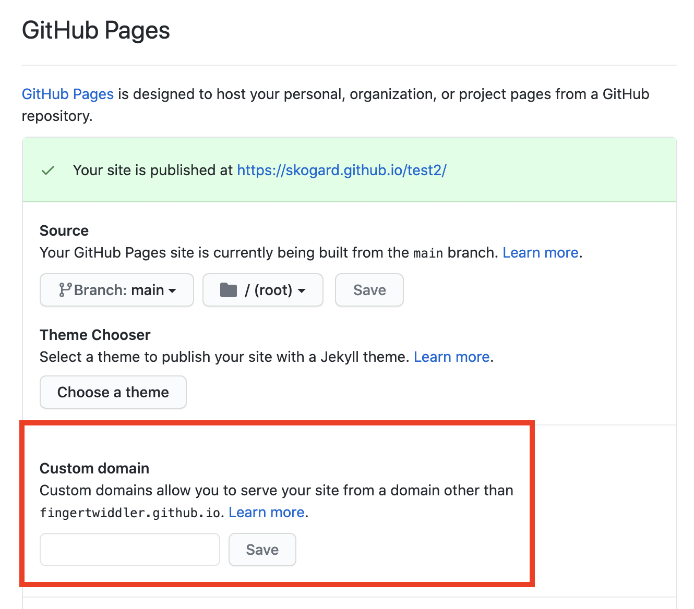

# Offpress

Offpress is a distributed CMS powered by Git, in the browser.

1. **Minimal:** The default Offpress engine is a simple blogging engine that focuses on content and gets out of the way.
2. **Extensible:** The architecture is extensible and you can add multiple modules
3. Free: There are many CMS services out there, but all of them have a "pricing model". This is because these platforms cost money to run, since they have to store all their user content on their server. Offpress doesn't require a server to operate because it's powered by [Offbase](https://offbase.org), a distributed web app framework that lets you replace centralized cloud components with distributed git.
4. **Open:** Offpress is completely open source. In fact it's impossible for Offpress to be NOT open source because of the way it works. The whole point of [Offbase](https://offbase.org) powered apps like Offpress is that the entire application logic is self contained and delivered straight to the browser, creating a virtual cloud environment inside the browser.

---

# FAQ

## 1. Where is my site published?

Visit the [Settings]([Options (github.com)](https://github.com/fingertwiddler/test2/settings)) page and scroll down to the "GitHub Pages" section. You should see something like this:

## 2. My site is not immediately updated?

Most of the times when you publish your site, it should be updated quickly, but sometimes it takes some time for GitHub pages to deploy and clear the cache, so it may take about a minute or so.

If you want to avoid these issues, you may want to check out CDN services dedicated to static site hosting, such as:

- [Netlify](https://www.netlify.com/)
- [Vercel](https://vercel.com/)

## 3. How do I use a custom domain?

Visit the [Settings]([Options (github.com)](https://github.com/fingertwiddler/test2/settings)) page and scroll down to the "GitHub Pages" section. You will find the custom URL settings:

## 4. Can I use CDN services other than GitHub pages?

Yes, nowadays there are several options that let you connect your GitHub account and they automatically take care of deployment. These CDN services include:

- [Netlify](https://www.netlify.com/)
- [Vercel](https://vercel.com/)

All you need to do is, connect this GitHub repository to the CDN of your choice, and deploy to GitHub as normal. One great thing about these services is that their build and deployments are near instant and faster than GitHub pages.
